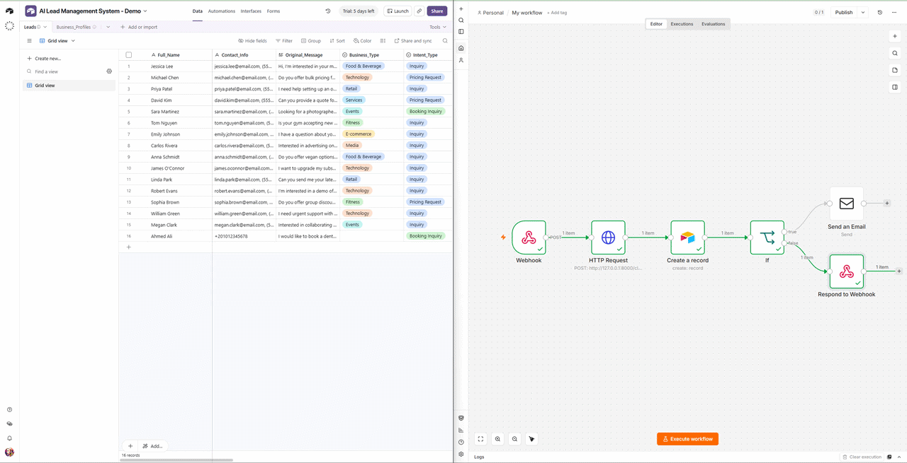

# ⚡ Enterprise AI Lead Classifier & CRM Orchestration Pipeline

[](https://fastapi.tiangolo.com)
[](https://ollama.ai)
[](https://n8n.io)
[](https://airtable.com)
[](https://opensource.org/licenses/MIT)

> A **zero-API-cost, privacy-first lead classification and triage engine**. Combines local LLM inference with automated workflow routing to qualify incoming leads, detect urgent inquiries, and update Airtable CRM in sub-seconds.

---

## 🎬 Live Demos & Execution Flows

### 1. Automated Booking & Lead Qualification
Demonstrates an incoming consultation booking request classified in real-time and synced directly to Airtable CRM:


### 2. High-Urgency Escalation & Instant Alerting
Demonstrates automatic detection of emergency/complaint intents, triggering immediate human escalation flags and alert emails:



---

## 🏗️ Architecture Overview

[ Incoming Lead / Webhook / Form ]
│
▼
[ n8n Orchestrator ]
│
▼ (REST API Call)
[ FastAPI Classification Engine ]
│
▼ (Local Inference)
[ Ollama - Llama 3.2 (3B) ]
│
▼ (Structured JSON Response)
[ Dynamic Routing Engine ]
├── Booking / General Lead ──► [ Airtable CRM: Active Lead ]
└── Urgent / Complaint     ──► [ Airtable: Flagged Urgent ] + [ Instant Email Alert ]


---

## 💼 Business Impact & Cost Comparison

| Metric | Cloud APIs (OpenAI GPT-4o-mini) | This Solution (Local FastAPI + Ollama) |
| :--- | :--- | :--- |
| **API Cost per 10k Leads** | ~$15 - $25/month | **$0.00 (Zero Token Fees)** |
| **Data Privacy (HIPAA/GDPR)** | Sent to 3rd-party servers | **100% On-Premise / Private** |
| **Response Latency** | ~800ms - 1.5s | **~250ms - 450ms** |
| **CRM Integration** | Custom Manual Code | **Automated via n8n & Webhooks** |

---

## 🚀 Quickstart Guide

### 1. Prerequisites
- Python 3.10+
- [Ollama](https://ollama.ai/) with `llama3.2:3b` pulled
- [n8n](https://n8n.io/) installed locally or via Docker

### 2. Backend Setup
```bash
# Clone the repository
git clone https://github.com/Zphrios/lead-classifier-service.git
cd lead-classifier-service

# Create virtual environment & install dependencies
python -m venv .venv
source .venv/bin/activate  # On Windows: .venv\Scripts\activate
pip install -r requirements.txt

# Run the classification server
uvicorn app.main:app --reload --port 8000
```

### 3. n8n Workflow Setup
1. Open n8n at `http://localhost:5678`.
2. Import the JSON workflow from `workflows/lead_intake_workflow.json`.
3. Configure your Airtable credentials and activate the workflow.

---

## 📂 Project Structure

```text
lead-classifier-service/
├── app/
│   ├── main.py              # FastAPI application entry point
│   ├── classifier.py        # Ollama LLM prompt & inference logic
│   └── schemas.py           # Pydantic input/output validation models
├── docs/
│   ├── ARCHITECTURE.md      # Detailed system design & decision records
│   ├── demo_booking.gif     # Recorded booking execution demo
│   └── demo_escalation.gif  # Recorded escalation execution demo
├── workflows/
│   └── lead_intake_workflow.json # Exported n8n production pipeline
├── requirements.txt         # Python dependencies
└── README.md                # Project documentation
```

---

## 📄 License
Distributed under the MIT License. See `LICENSE` for more information.